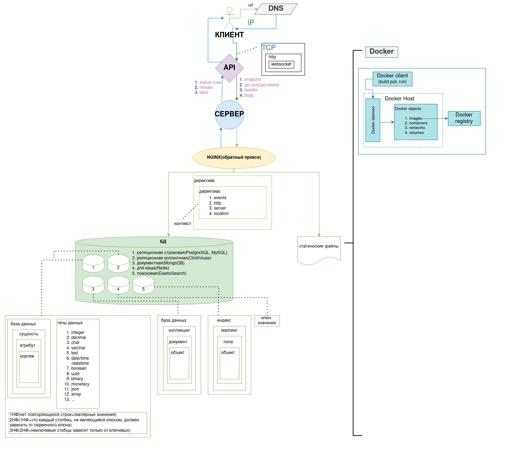

# ПРОЕКТЫ

# СТЕК
* Ubuntu 22.04.1 LTS
* Python (vscode ide)
* Git
* Databases
* Postman
* Docker
* Django
* Flask
* FastAPI

### логика работы git

### логика работы веб-сервиса

1. структурно веб-сервис состоит из двух частей: бэкенд(сервер) и фронтэнд(пользователь)
2. когда пользователь вводит в адресную строку браузера адрес сайта, данный адрес отдается DNS сервису, который возвращает соответствующий ему IP-адрес
3. транспортировка осуществляется по протоколу TCP или UDP. 
4. в настоящее время стандартом является TCP/IP
5. TCP включает в себя http(синхронный), http расширяется до websocket(асинхронный): изначально связь устанавливается по http -> идет запрос на соединение по websocket(если требуется)
7. примеры веб-серверов: 
   * wsgi, gunicorn (синхронные)
   * asgi, uvicorn (асисинхронные)
8. с помощью API идет взаимодействие между БД и вебсервером
9. API включает в себя запрос(request), ответ(response)
10. request состоит из: endpoint, method(get, post, put, delete), header, body
11. response состоитиз: status code(200, 400, 500), header, data 
11. API можно реализовать с помощью: Django, Flask, FastAPI(асинхронный)
12. бэкенд состоит из 3 сущностей: 
    * Model(абстрактное представление данных в БД)
    * View(реальное представление отдаваемых данных)
    * Controller(обеспечивает взаимодействие Model-View)
13. типы БД

| тип                    | описание                   | описание                |элементы| 
|------------------------|----------------------------|-------------------------|---|
| реляционная строковая  | классичекая                | sqlite, postgres, mysql |бд-сущность-атрибут-кортеж|
| реляционная колоночная | аналитическая              | clickhouse              |бд-сущность-атрибут-кортеж|
| документная            | для хранения json          | MongoDB                 |бд-коллекция-документ-объект|
| кэш                    | для хранения куки          | Redis                   |ключ-значение|
| поисковая              | для полнотекстового поиска | ElasticSearch           |индекс-мэппинг-поле-объект|

14. статические файлы отдаются прокси сервером nginx(директивы->контексты:events, http, server, location), который получает запрос и отправляет его на бэкенд или отдает подготовленные статические файлы (снижение нагрузки на сервер)

контексты:

    * events (определяет глобальные параметры, влияющие на то, как Nginx обрабатывает соединения)
    * http
    * server
    * location

15. каждый сервис упаковывается в Docker контейнер
16. сервисы объединяются с помощью Docker compose
17. контейнеры оркестрируются с помощью Kubernetes
18. оркестрация процессов осуществляетсяс помощью Airflow
