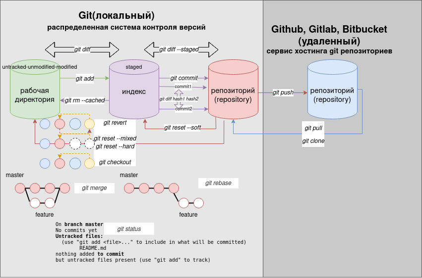

# GIT

### Определение
Git - это система контроля версий

### Объекты

|объект|описание|
|---|---|
|blob (binary large object)|содержимое файла|
|tree|каталог на файловой системе|
|commit|информация об изменениях(формат объекта коммита прост: в нём указано дерево верхнего уровня, соответствующее состоянию проекта на некоторый момент; родительские коммиты, если существуют (в примере выше объект коммита не имеет родителей); имена автора и коммиттера (берутся из полей конфигурации user.name и user.email) с указанием временной метки; пустая строка и сообщение коммита)|

### Работа с git
1. Инициализация репозитория осуществляется команда ```git init```<br>
После инициализации репозитория создается скрытая директория ```.git``` [архитектура .git](https://githowto.com/ru/git_internals_git_directory)<br>
```
|_.git
    |_COMMIT_EDITMSG  
    |_MERGE_RR
    |_config (файл конфигурации, создающийся для каждого конкретного проекта. Записи в этом файле будут перезаписывать записи в файле .gitconfig вашего главного каталога, по крайней мере в рамках этого проекта)
    |_hooks (операции, выполняющиеся при коммите)
    |_info
    |_objects (база данных объектов - все объекты сжаты и закодированы)
    |_rr-cache
    |_HEAD (указатель на текущую ветку)
    |_ORIG_HEAD
    |_description index
    |_logs
    |_refs (веткии теги)
```

2. Алгоритм работы с git

